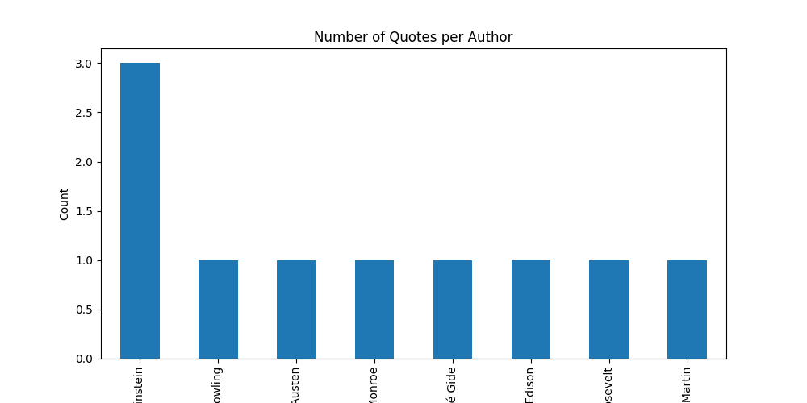

# 🌐 Web Scraping & Data Visualization

## 📌 Project Overview

This project demonstrates web scraping and data analysis by extracting quotes and authors from a website and visualizing insights.

---

## 🛠️ Technologies Used

* Python
* Requests
* BeautifulSoup
* Pandas
* Matplotlib

---

## 🌐 Data Source

* Website: http://quotes.toscrape.com
* Extracted quotes and author names

---

## 📂 Features

* Web scraping using BeautifulSoup
* Data storage in CSV format
* Data analysis using Pandas
* Visualization using Matplotlib

---

## 📊 Output Visualization



---

## ▶️ How to Run

1. Install dependencies:

```id="c8n3cf"
pip install requests beautifulsoup4 pandas matplotlib
```

2. Run:

```id="j2j4r4"
python main.py
```

---

## 💡 Key Learnings

* HTML parsing
* Web data extraction
* Data cleaning and structuring
* Visualization of insights

---

## 🚀 Future Improvements

* Scrape multiple pages
* Store data in database
* Build dashboard

---

## 👩‍💻 Author

Tarushi Mahesh
